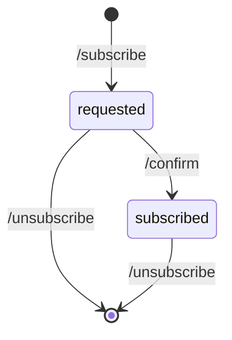

# Auroras Watch

Get notified when strong Aurora activity is planned in North America

## Deployment

To deploy this application:
1. run `cdk deploy` from the root of the repo
2. create a SecureString AWS Systems Manager Parameter called "icloud_smtp_pass" with the SMTP password to use to send
   the email

## State of Subscriptions

